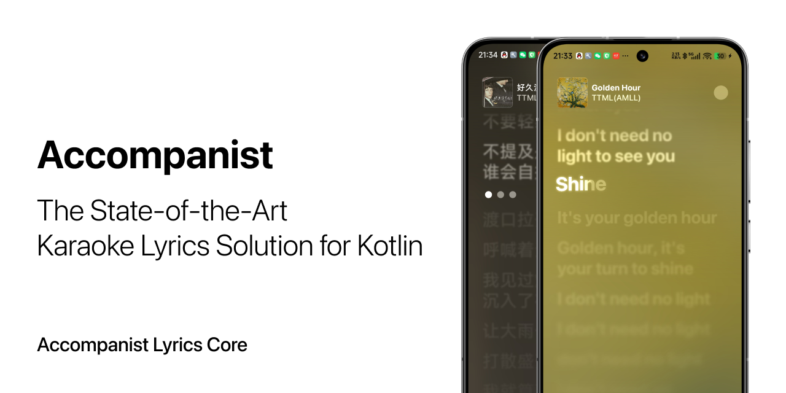

[](https://github.com/Mocha-Realm/Accompanist-Lyrics/actions/workflows/test.yml)
[](https://central.sonatype.com/artifact/com.mocharealm.accompanist/lyrics-core)
[](https://t.me/mocha_pot)
[](http://www.apache.org/licenses/LICENSE-2.0.txt)

> [!IMPORTANT]
> 此目录是 `NeriPlayer` 工程内维护的 `accompanist-lyrics` fork 子模块，用于项目集成与定制修改；它**不是**上游官方仓库。若你要查阅官方说明、发布、Issue 或提交记录，请优先访问上游项目，并以原作者/上游仓库信息为准。  
> This directory is a `NeriPlayer`-maintained forked `accompanist-lyrics` submodule for project integration and custom changes. It is **not** the official upstream repository. If you are looking for official docs, releases, issues, or commit history, please refer to the upstream project and treat the original authors/upstream repository as the source of truth.

## 📦 Repository

Accompanist released a group of artifacts, including: 

- [`lyrics-core`](https://github.com/6xingyv/Accompanist-Lyrics) - Parsing lyrics file, holding data and exporting to other formats.

- [`lyrics-ui`](https://github.com/6xingyv/Accompanist) - Standard lyrics interface built on Jetpack Compose

This repository hosts the `lyrics-core` code.

## ✨ Features

- **🤖 Smart Auto-Detection**: Automatically detects and parses various lyrics formats out of the box.
- **🎤 Karaoke-Ready**: Provides syllable-level timing for precise karaoke-style highlighting.
- **🌐 Translation Support**: Natively handles dual-language or translated lyric lines.
- **🧩 Highly Extensible**: Easily add support for new or custom formats.
- **🏷️ Metadata Extraction**: Reads standard tags like artist, album, title, and offset.
- **🚀 Pure Kotlin/JVM**: No Android dependencies, suitable for any Kotlin project.

## 💿 Supported Formats

- **LRC**: Standard and dual-language `.lrc` files.
- **Enhanced LRC**: Syllable-level timing, voice separation, and accompaniment tags.
- **TTML (Apple Syllable)**: The format used by Apple Music.
- **Lyricify Syllable**: Custom format from the [Lyricify App](https://github.com/WXRIW/Lyricify-App).

## 🚀 Installation

Add the dependency to your `build.gradle.kts`:

```kotlin
dependencies {
    implementation("com.mocharealm.accompanist:lyrics-core:VERSION")
}
```

*Replace `VERSION` with the latest version from Maven Central.*

-----

## ▶️ Usage

### Quick Start: Auto-Parsing (Recommended)

For most use cases, `AutoParser` is the easiest way to parse lyrics without needing to know the format beforehand.

```kotlin
// 1. Get your lyrics content from a file or network
val lyricsContent: String = fetchLyrics()

// 2. Create a default AutoParser instance
val autoParser = AutoParser()

// 3. Parse the content
val lyrics = autoParser.parse(lyricsContent)

// Now you have a unified SyncedLyrics object!
println(lyrics.metadata.title)
println(lyrics.lines.first().text)
```

### Parsing a Specific Format

If you know the exact format, you can use a specific parser directly.

```kotlin

val lrcLines = listOf(
    "[00:39.96]I lean in and you move away",
    "[00:39.96]我靠在里面，你就离开"
)

val lyrics = LrcParser.parse(lrcLines)
println(lyrics.lines)
```

*You can also use `EnhancedLrcParser`, `TTMLParser`, or `LyricifySyllableParser`.*

-----

## 🛠️ Extending with Custom Formats

Accompanist Lyrics is designed to be extensible. You can add support for any custom format by implementing the `ILyricsParser` interface and registering it with the `AutoParser`.

### Step 1: Implement `ILyricsParser`

Create a class that implements the parsing logic for your custom format.

```kotlin
class MyCustomParser : ILyricsParser {
    override fun canParse(content: String): Boolean {
        // Check if your parser can parse or not
        // Example: check for a unique tag
        return content.startsWith("##MY_COOL_LYRICS##")
    }

    override fun parse(lines: List<String>): SyncedLyrics {
        // Your parsing logic here...
    }

    override fun parse(content: String): SyncedLyrics {
        // Your parsing logic here...
    }
}
```

### Step 2: Register with `AutoParser`

Pass your custom parser to the `AutoParser` constructor. Custom formats are checked in the order they are provided in the list, ensuring they are prioritized over built-in ones if placed first.

```kotlin
// Build an AutoParser instance with your custom parser alongside built-in ones
val autoParser = AutoParser(
    listOf(
        MyCustomParser(), // Checked first
        KugouKrcParser,
        TTMLParser,
        LyricifySyllableParser,
        EnhancedLrcParser,
        LrcParser
    )
)

// This parser now understands both built-in and your custom format!
val lyrics = autoParser.parse(myCustomLyricsContent)
```
## 💬 Community & Support

Join the community, ask questions, and share your projects!

- **Telegram:** [**mocha\_pot**](https://t.me/mocha_pot)
- **GitHub Issues:** [**Create an Issue**](https://www.google.com/search?q=https://github.com/6xingyv/Accompanist-Lyrics/issues)

## 🤝 Contributing

Contributions are welcome\! Please feel free to submit a pull request or open an issue to discuss your ideas. For major changes, please open an issue first.


## 📜 License

This project is licensed under the **Apache License 2.0**. See the [LICENSE](http://www.apache.org/licenses/LICENSE-2.0.txt) file for details.